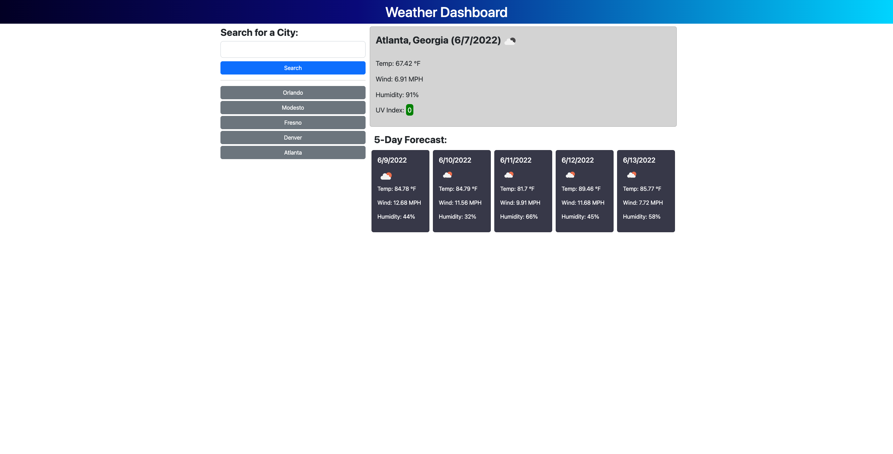

# Weather Dashboard

## Table of contents

- [Overview](#overview)
  - [The challenge](#the-challenge)
  - [User Story](#user-story)
  - [Acceptance Criteria](#acceptance-criteria)
  - [Screenshot](#screenshot)
  - [Links](#links)
- [My process](#my-process)
  - [Built with](#built-with)
  - [What I learned](#what-i-learned)
  - [Useful resources](#useful-resources)
- [Author](#author)

## Overview

### The challenge

Challenge of this assignment is to create a weather application that uses the OpenWeather API to get data and then display it onto the page.

### User Story

AS A traveler  
I WANT to see the weather outlook for multiple cities  
SO THAT I can plan a trip accordingly  

### Acceptance Criteria

GIVEN a weather dashboard with form inputs  
WHEN I search for a city  
THEN I am presented with current and future conditions for that city and that city is added to the search history  
WHEN I view current weather conditions for that city  
THEN I am presented with the city name, the date, an icon representation of weather conditions, the temperature, the humidity, the wind speed, and the UV index  
WHEN I view the UV index  
THEN I am presented with a color that indicates whether the conditions are favorable, moderate, or severe  
WHEN I view future weather conditions for that city  
THEN I am presented with a 5-day forecast that displays the date, an icon representation of weather conditions, the temperature, the wind speed, and the humidity  
WHEN I click on a city in the search history  
THEN I am again presented with current and future conditions for that city  

### Screenshot



### Links

- Solution URL: https://github.com/ayeh6/Weather-Dashboard/
- Live Site URL: https://ayeh6.github.io/Weather-Dashboard/

## My process

### Built with

- HTML5
- CSS
- Javascript
- jQuery
- Bootstrap

### What I learned

For this assignment, it was again looking at documentation of Bootstrap to see how I can create the page using their elements and classes. I was able to use their rows and cols to create the structure of the page, then using their buttons and input for the search portion. When it came to the javascript, one tricky part was to re-query the search using the saved search history buttons. To do this I made an onclick listener for the whole document targetting specifically buttons with the btn-secondary class. Then using the $(this) I was able to pull the text from the button and then use that text for the search function.

Here is the code for the onclick listener:

```js
$(document).on(`click`,`.btn-secondary`,function() {    
    getLatLon($(this).text());
});
```

### Useful resources

- [w3schools](https://www.w3schools.com/) - Always a big help when having to look up resources for jQuery functions.
- [OpenWeather API](https://openweathermap.org/api) - Great API with good documentation and a very polished JSON format.

## Author

- Website - [Andrew Yeh](https://ayeh6.github.io/Yeh-Andrew-Portfolio-Website/)
- LinkedIn - [/in/ayeh6](https://www.linkedin.com/in/ayeh6/)
